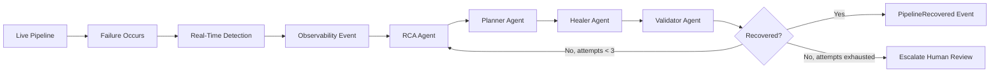

# Agentic Self-Healing Data Platform

## Target Flow

The framework now supports an autonomous mode that moves beyond scripted scenario healing:



Existing deterministic healing still runs first inside the ETL transformer. Autonomous mode wraps the live pipeline with observability, root-cause analysis, planning, bounded healing actions, validation, incident memory, and audit persistence.

## New CLI Mode

```bash
python -B main.py --autonomous-mode --source orders.csv --dest output.csv
python -B main.py --taxi-demo --taxi-records 30 --autonomous-mode
python -B main.py --taxi-demo --taxi-records 30 --autonomous-mode --human-approval
```

Existing CLI modes remain unchanged. Autonomous behavior is opt-in through `--autonomous-mode`.

## New Modules

| Module | Responsibility |
|---|---|
| `agents/observer_agent.py` | Detects failure-worthy events. |
| `agents/rca_agent.py` | Performs RCA through incident memory, Ollama, or deterministic rules. |
| `agents/planner_agent.py` | Converts RCA into executable plan steps. |
| `agents/healer_agent.py` | Executes plan steps through the autonomous healing engine. |
| `agents/validator_agent.py` | Validates recovery confidence. |
| `agents/autonomous_loop.py` | Runs RCA -> plan -> heal -> validate up to 3 attempts. |
| `agents/ai_sre_loop.py` | Connects Kubernetes observation to the autonomous loop with event deduplication. |
| `agents/k8s_observer.py` | Emits Kubernetes workload failures through the existing event bus. |
| `observability/event_bus.py` | Persists and publishes pipeline events. |
| `observability/telemetry.py` | Reads run, event, and quarantine telemetry. |
| `observability/traces.py` | Generates trace and span IDs. |
| `observability/metrics.py` | Provides dashboard health metrics. |
| `knowledge/incident_store.py` | Stores and searches historical incidents. |
| `knowledge/runbook_store.py` | Provides deterministic RCA fallback rules. |
| `knowledge/healing_history.py` | Persists healing action audit records. |
| `healing/autonomous_healing.py` | Executes bounded autonomous healing actions. |
| `healing/k8s_healing.py` | Executes bounded Kubernetes actions and reuses audit/approval tables. |
| `llm/ollama_client.py` | Optional Ollama JSON generation client. |

## Observability Events

Every run receives a `trace_id`. Major stages receive `span_id` values. Events are persisted in `pipeline_events`.

Current emitted events include:

- `PipelineStarted`
- `BatchReceived`
- `ExtractCompleted`
- `TransformStarted`
- `TransformFailed`
- `SchemaDriftDetected`
- `QuarantineTriggered`
- `TransformCompleted`
- `LoadStarted`
- `LoadFailed`
- `LoadCompleted`
- `HealingStarted`
- `HealingCompleted`
- `HealingValidationFailed`
- `PipelineRecovered`
- `PipelineEscalated`
- `PipelineCompleted`
- `PipelineFailed`
- `HumanApprovalRequested`
- `K8sDeploymentDegraded`
- `K8sImagePullFailed`
- `K8sPodCrashLoopDetected`
- `K8sOOMKilled`
- `K8sJobFailed`
- `K8sHighRestartCount`
- `K8sDiagnosticLog`

## RCA Behavior

RCA resolution order:

1. Search successful historical incidents in `incident_history`.
2. Try Ollama if enabled and reachable.
3. Fall back to deterministic runbook rules.

Ollama is optional. The pipeline never fails just because Ollama is unavailable.

Supported Ollama models are configured through:

- `OLLAMA_MODEL`, default `llama3.2:latest`
- `OLLAMA_FALLBACK_MODEL`, default `llama3.2:latest`
- `OLLAMA_URL`, default `http://localhost:11434`

## Healing Plan Types

Supported plan/action categories include:

- schema evolution
- missing column backfill
- type coercion
- batch replay
- retry extraction
- retry loading
- retry staging task
- apply exponential backoff
- rollback transaction
- replay quarantine records
- create missing table
- add missing destination column
- reconnect database
- reduce batch size
- split batch
- collect more telemetry
- escalate human review

Kubernetes AI-SRE plan/action categories include:

- restart deployment
- rollback deployment
- scale deployment
- retry job
- inspect image
- inspect pod logs
- validate registry
- inspect node resources
- refresh ConfigMap
- collect more telemetry

Kubernetes actions run through `K8sHealingEngine` when `AutonomousHealingLoop` is constructed with an injected `healing_engine`.

Risky actions are persisted and escalated instead of pretending to execute external infrastructure operations.

## Traceability

Autonomous actions are persisted in `healing_actions`:

- run ID
- trace ID
- root cause
- action taken
- agent name
- before state
- after state
- success flag
- timestamp

Human approval mode persists pending plans in `human_approvals`.

## Dashboard Changes

The Streamlit dashboard now includes tabs for:

1. Pipeline Health
2. Live Events
3. Root Cause Analysis
4. Healing Timeline
5. Agent Decisions
6. Taxi Analytics
7. Kubernetes Health
8. Cluster Events
9. AI-SRE Incidents
10. Healing Actions
11. Recovery Metrics

The dashboard reads `pipeline_events`, `healing_actions`, and `human_approvals` from the observability DB URL, which defaults to the taxi quarantine database.

Kubernetes tabs use the same observability DB and show empty states gracefully when no cluster events are present.

The sidebar includes:

- Observability DB URL.
- Observability scope selector, with `All pipelines` as the default.
- Auto-refresh interval, defaulting to 120 seconds.
- Manual `Refresh now` button.

Pipeline Health, Live Events, Root Cause Analysis, Healing Timeline, Agent Decisions, and K8s recovery views now use the same selected scope so failure/healing traces do not appear in one tab while disappearing from the related tabs.

## Kubernetes AI-SRE Mode

The local Kubernetes demo uses `agents.ai_sre_loop` inside the AI-SRE container:

```bash
python -m agents.ai_sre_loop
```

`AISRELoop` polls Kubernetes through `K8sObserver`, subscribes `ObserverAgent` to the shared `EventBus`, deduplicates repeated failures, and forwards failure events to `AutonomousHealingLoop` with `K8sHealingEngine` injected.

The validated local Docker Desktop path is:

```powershell
powershell -ExecutionPolicy Bypass -File .\deploy_local_demo.ps1
python demo_k8s.py --scenario image_pull
```

The image-pull scenario has been verified to recover with an approximate MTTR of `17.7s`.
