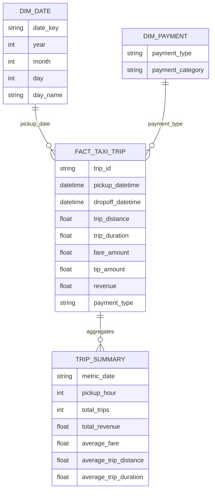

# Data Model And Warehouse Design

## Application Metadata Tables

The framework uses SQLAlchemy ORM models in `models.py`.

### `schema_versions`

Stores versioned source schemas.

| Column | Type | Purpose |
|---|---|---|
| `id` | Integer PK | Surrogate key. |
| `source_name` | String | Logical source identifier. |
| `version` | Integer | Version number for the source. |
| `schema_json` | Text | JSON mapping of column name to canonical dtype. |
| `registered_at` | DateTime | Registration timestamp. |
| `is_active` | Boolean | Active schema marker. |

### `pipeline_runs`

Stores pipeline execution status and counts.

| Column | Type | Purpose |
|---|---|---|
| `run_id` | String unique | Runtime identifier used across events and quarantine. |
| `pipeline_name` | String | Logical pipeline name. |
| `source_name` | String | Logical source name. |
| `status` | String | `RUNNING`, `SUCCESS`, or `FAILED`. |
| `rows_extracted` | Integer | Extract count. |
| `rows_loaded` | Integer | Load count. |
| `rows_quarantined` | Integer | Quarantine count. |
| `drift_detected` | Boolean | Whether drift was observed. |
| `started_at` | DateTime | Run start timestamp. |
| `finished_at` | DateTime | Run finish timestamp. |
| `error_message` | Text | Failure message for failed runs. |

### `drift_events`

Stores detected schema drift.

| Column | Type | Purpose |
|---|---|---|
| `pipeline_name` | String | Pipeline name. |
| `source_name` | String | Source name. |
| `run_id` | String | Pipeline run ID. |
| `drift_type` | String | Comma-separated drift types. |
| `details_json` | Text | Drift details and root-cause hints. |
| `detected_at` | DateTime | Detection timestamp. |
| `healed` | Boolean | Whether the event was healed. |
| `healing_action` | Text | Description of healing action. |

### `quarantine_records`

Stores failed records for review.

| Column | Type | Purpose |
|---|---|---|
| `pipeline_name` | String | Pipeline name. |
| `source_name` | String | Source name. |
| `run_id` | String | Pipeline run ID. |
| `record_json` | Text | Raw record JSON. |
| `error_type` | String | Failure category. |
| `error_detail` | Text | Detailed error message. |
| `root_cause_hint` | Text | Suggested cause. |
| `quarantined_at` | DateTime | Quarantine timestamp. |
| `schema_version` | Integer | Expected schema version when available. |
| `resolved` | Boolean | Manual resolution flag. |
| `resolved_at` | DateTime | Manual resolution timestamp for MTTR. |

## Taxi Warehouse Tables

The taxi warehouse is configured in `taxi_etl/config.py`.

| Table | Purpose |
|---|---|
| `raw_taxi_trip` | Stores taxi records as received before business transformation. |
| `fact_taxi_trip` | Stores cleaned and enriched trip facts. |
| `dim_date` | Date dimension for analytics. |
| `dim_payment` | Payment type dimension. |
| `trip_summary` | Aggregated metrics used by the dashboard. |

## Agentic Observability Tables

### `pipeline_events`

Stores real-time, traceable events from each ETL stage and agent.

| Column | Purpose |
|---|---|
| `timestamp` | Event time. |
| `run_id` | Pipeline run identifier. |
| `pipeline_name` | Pipeline name. |
| `event_type` | Event name such as `SchemaDriftDetected` or `HealingCompleted`. |
| `severity` | `INFO`, `WARNING`, or `ERROR`. |
| `component` | Emitting component. |
| `message` | Human-readable event message. |
| `metadata_json` | Structured event metadata. |
| `trace_id` | End-to-end trace identifier. |
| `span_id` | Stage-level span identifier. |

### `incident_history`

Stores operational memory for similar-failure lookup before invoking Ollama.

| Column | Purpose |
|---|---|
| `failure_signature` | Normalized failure signature. |
| `root_cause` | Stored RCA result. |
| `healing_action` | Previously successful action summary. |
| `successful` | Whether the prior incident healed successfully. |
| `timestamp` | Incident timestamp. |

### `healing_actions`

Stores every autonomous action for audit.

| Column | Purpose |
|---|---|
| `run_id` | Pipeline run identifier. |
| `trace_id` | Trace identifier. |
| `root_cause` | RCA root cause. |
| `action_taken` | JSON action payload. |
| `agent` | Agent that executed the action. |
| `before_state` | JSON state before action. |
| `after_state` | JSON state after action. |
| `success` | Action success flag. |
| `timestamp` | Action timestamp. |

### `human_approvals`

Stores pending plans when human-in-the-loop mode is enabled.

## Taxi Fact Grain

`fact_taxi_trip` is one row per taxi trip after cleaning and enrichment.

Typical columns:

- `trip_id`
- `vendor_id`
- `pickup_datetime`
- `dropoff_datetime`
- `passenger_count`
- `trip_distance`
- `fare_amount`
- `tip_amount`
- `payment_type`
- `trip_duration`
- `revenue`
- `pickup_hour`
- evolved columns such as `congestion_surcharge`

## Logical Star Schema

## Metrics Derivations

| Metric | Formula |
|---|---|
| Trip duration | `(dropoff_datetime - pickup_datetime) / 60 seconds` |
| Revenue | `fare_amount + tip_amount` |
| Pickup hour | `pickup_datetime.hour` |
| Total trips | `count(*)` |
| Total revenue | `sum(revenue)` |
| Average fare | `avg(fare_amount)` |
| Average trip distance | `avg(trip_distance)` |
| Average trip duration | `avg(trip_duration)` |
| MTTD | `avg(DriftEvent.detected_at - PipelineRun.started_at)` |
| MTTR | `avg(QuarantineRecord.resolved_at - QuarantineRecord.quarantined_at)` |

## Schema Evolution Behavior

When schema evolution is enabled:

1. Added columns are retained.
2. The schema registry stores a new active schema version.
3. The DB loader adds missing destination table columns before append.
4. Subsequent batches converge against the evolved schema.

## Retention

`QuarantineStore.purge_old(older_than_days)` deletes only resolved quarantine records older than the configured cutoff. Unresolved records are preserved for review.
