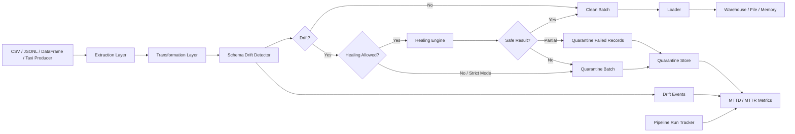
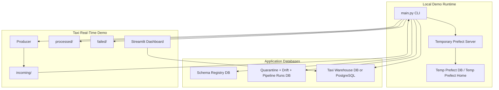

# High-Level Design: Self-Healing Real-Time ETL

## Purpose

This solution demonstrates a self-healing ETL framework with a realistic NYC Taxi-style real-time pipeline. It ingests data, detects schema drift and data-quality failures, applies automated healing where safe, quarantines records that require review, loads clean data into a warehouse, and exposes evaluation metrics such as MTTD and MTTR.

## Objectives

- Ingest batch, micro-batch, and simulated real-time taxi records.
- Detect schema drift across added columns, removed columns, and type changes.
- Auto-heal recoverable drift by type coercion, missing-column backfill, and schema evolution.
- Quarantine bad records or unsafe batches without silently dropping data.
- Load clean records into file, memory, SQLite, or SQLAlchemy-compatible database targets.
- Track operational metrics, including pipeline detection latency and manual quarantine resolution time.
- Provide executable failure and auto-healing scenarios for demos and validation.
- Add an optional agentic mode for live failure detection, RCA, planning, healing execution, validation, recovery, and audit.

## Architecture

## Major Components

| Component | Responsibility |
|---|---|
| CLI | Provides entry points for demo, taxi demo, streaming watcher, generic ETL, and scenario coverage. |
| Prefect Orchestrator | Coordinates extract, transform, and load tasks and records run status. |
| Extractor | Reads CSV, JSONL, or DataFrame inputs in batches. |
| Transformer | Applies optional business transform, registers baseline schema, detects drift, heals, and quarantines failures. |
| Schema Registry | Stores active source schemas and schema versions. |
| Drift Detector | Compares observed pandas schema against the active registered schema. |
| Healing Engine | Applies missing-column backfill, type coercion, and schema evolution handling. |
| Quarantine Store | Persists failed records, drift events, resolution status, and metrics inputs. |
| Loader | Writes clean batches to CSV, JSONL, memory, or SQLAlchemy DB tables. |
| Taxi ETL | Simulates real-time NYC Taxi ingestion, transformation, warehouse loading, and analytics refresh. |
| Failure Scenarios | Executes actual pipeline scenarios covering recoverable, partially recoverable, and quarantine outcomes. |
| Agent Layer | Observes events, performs RCA, plans remediations, executes bounded healing actions, validates recovery, and persists decisions. |
| Observability Layer | Persists traceable pipeline events with run, trace, span, severity, component, and metadata. |
| Knowledge Layer | Stores historical incidents and healing action history for operational memory. |

## Deployment View

## Runtime Modes

| Mode | Command | Purpose |
|---|---|---|
| Built-in demo | `python main.py --demo` | Shows baseline, drift, quarantine, schema evolution, and metrics. |
| Generic ETL | `python main.py --source orders.csv --dest output.csv` | Runs user-provided CSV or JSONL through the framework. |
| Taxi demo | `python main.py --taxi-demo --taxi-records 30` | Produces taxi micro-batches and processes them into the warehouse. |
| Taxi watcher | `python main.py --taxi-stream` | Continuously monitors the taxi incoming folder. |
| Auto-healing scenarios | `python main.py --failure-scenarios` | Runs recoverable and quarantine scenarios without hard pipeline failures. |
| Hard-failure drills | `python main.py --failure-scenarios --include-hard-failures` | Adds missing-source and invalid-destination failures for manual rerun evidence. |
| Autonomous mode | `python main.py --taxi-demo --autonomous-mode` | Enables event-driven RCA, planning, healing, validation, and recovery audit. |

## Data Flow

1. Input is read as pandas DataFrame batches.
2. Optional custom transform performs domain logic, such as taxi cleaning and enrichment.
3. First valid transformed batch registers the baseline schema for the source.
4. Later batches are compared against the active schema.
5. Recoverable drift is healed and clean records continue to loading.
6. Unsafe records or batches are quarantined with error details and root-cause hints.
7. Drift events and pipeline runs are persisted for audit and metrics.
8. Clean output is loaded into the configured destination.

## Auto-Healing Scope

| Failure / Drift | Automated Response |
|---|---|
| Added columns | Keep column when schema evolution is enabled; register new schema version. |
| Removed columns | Backfill missing columns with typed nulls. |
| Type changes | Coerce to expected type when possible. |
| Partial coercion failures | Load healed rows and quarantine failed records. |
| High coercion loss | Quarantine full batch. |
| Strict schema mode | Quarantine drifted batch without healing. |
| Transform exception | Quarantine batch. |
| Join missing dimension member | Map to configured unknown member in scenario transform. |
| Join duplicate dimension keys | Deduplicate dimension rows before join in scenario transform. |
| Loader schema addition | Alter DB table with missing columns before append. |

## Metrics

| Metric | Definition |
|---|---|
| MTTD | Pipeline detection latency: `DriftEvent.detected_at - PipelineRun.started_at`. |
| MTTR | Manual quarantine resolution latency: `QuarantineRecord.resolved_at - QuarantineRecord.quarantined_at`. |

MTTD is intentionally not treated as true upstream incident detection time because the framework does not assume a universal business timestamp column such as `event_time`.

## Key Design Decisions

- Use pandas for transparent, demo-friendly transformation logic.
- Use Prefect for task orchestration and retries while keeping demo runtime local.
- Use SQLAlchemy so SQLite demos can evolve toward PostgreSQL without changing the framework boundary.
- Register baseline schema after custom transformation so the schema represents business-ready data, not raw source shape.
- Keep hard failures opt-in so the default scenario suite proves auto-healing without ending in an intentional OS-level failure.
- Keep Ollama optional and use deterministic RCA when it is unavailable.
- Persist every autonomous decision in `pipeline_events`, `incident_history`, `healing_actions`, or `human_approvals`.

## Assumptions

- Batch and micro-batch processing are sufficient for the real-time simulation.
- The warehouse can be SQLite for local demo or PostgreSQL through SQLAlchemy URL.
- Schema drift is evaluated at the DataFrame schema level.
- Manual resolution of quarantine records happens outside the pipeline and is recorded through `mark_resolved`.

## Risks And Mitigations

| Risk | Mitigation |
|---|---|
| False-positive type drift from pandas dtype inference | Canonical dtype buckets reduce noise; type coercion handles common cases. |
| Data loss from aggressive coercion | Coercion loss gate quarantines unsafe batches. |
| Downstream schema mismatch | Loader can add missing table columns for healed/evolved batches. |
| Demo permission issues in OneDrive/user home | Prefect runtime state is routed to temp folders. |
| Hidden data-quality issues | Failed records are stored with raw JSON, error type, detail, and root-cause hints. |
