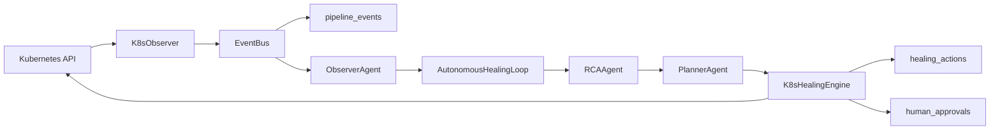

# Kubernetes AI-SRE Extension

## Purpose

The Kubernetes AI-SRE extension adds opt-in cluster observability and bounded remediation to the Self-Healing ETL Framework. It does not replace any ETL runtime mode. Local SQLite development, taxi demos, failure scenarios, and autonomous ETL healing continue to work without Kubernetes access.

The primary demo path is Docker Desktop Kubernetes, Minikube, or Kind on a local machine.

## Components

| Component | Purpose |
|---|---|
| `agents/k8s_observer.py` | Namespace-scoped Kubernetes poller. Emits K8s failure events through `EventBus`. |
| `agents/ai_sre_loop.py` | Orchestration glue: K8s observer, `ObserverAgent`, `AutonomousHealingLoop`, and `K8sHealingEngine`. Includes event deduplication. |
| `healing/k8s_healing.py` | Bounded Kubernetes action executor with audit and approval integration. |
| `scenarios/k8s_failure_injector.py` | Injects reversible failures into a real cluster. |
| `scenarios/failure_injector.py` | Unified injector for K8s failures plus local ETL staging/connectivity failures. |
| `demo_k8s.py` | Interactive local demo runner that injects K8s or ETL failures and prints approximate MTTR. |
| `deploy_local_demo.ps1` | Builds local images, applies manifests, restarts deployments, and waits for readiness. |
| `deployment/` | Dockerfiles and Kubernetes manifests. |

## Architecture



## Local Docker Kubernetes Demo

Prerequisites:

- Docker Desktop running.
- Kubernetes enabled in Docker Desktop, or Minikube/Kind configured in current `kubectl` context.
- `kubectl cluster-info` succeeds.
- Python dependencies installed locally with `pip install -r requirements.txt`.

Deploy:

```powershell
powershell -ExecutionPolicy Bypass -File .\deploy_local_demo.ps1
```

The bypass is process-scoped and is used because some Windows machines block direct `.ps1` execution by policy.

Run the image-pull self-healing demo:

```bash
python demo_k8s.py --scenario image_pull
```

Validated Docker Desktop Kubernetes result:

```text
K8sDeploymentDegraded detected
K8sImagePullFailed detected
Deployment recovered. Approximate MTTR: 17.7s
```

Expected final pod state:

```text
ai-sre             1/1 Running
postgres-0         1/1 Running
self-healing-etl   1/1 Running
```

For dashboard review, open Streamlit and keep `Observability scope` set to `All pipelines`. The dashboard auto-refreshes every 120 seconds by default and also includes a manual `Refresh now` button.

## Demo Scenarios

| Scenario | Command | Injection |
|---|---|---|
| Image pull failure | `python demo_k8s.py --scenario image_pull` | Patches ETL image to `registry.local/does-not-exist:latest`. |
| Crash loop | `python demo_k8s.py --scenario crash_loop` | Patches ETL container to `busybox` and exits immediately. |
| OOM | `python demo_k8s.py --scenario oom` | Patches memory request/limit to `1Mi`. |
| Scale zero | `python demo_k8s.py --scenario scale_zero` | Scales ETL Deployment to `0` replicas. |

Modern ETL scenarios through the same entry point:

| Scenario | Command | Recovery |
|---|---|---|
| API rate limit | `python demo_k8s.py --scenario api_rate_limit` | Applies exponential backoff and retries extraction. |
| Staging data quality | `python demo_k8s.py --scenario staging_data_quality` | Quarantines duplicate/null-key rows and lets clean rows proceed. |
| Timeout | `python demo_k8s.py --scenario timeout` | Performs idempotent staging retry and load retry. |
| Concurrent modification | `python demo_k8s.py --scenario concurrent_modification` | Requests transaction rollback and retries the staging task. |

## Event Types

| Event Type | Meaning |
|---|---|
| `K8sPodCrashLoopDetected` | A pod container is waiting with `CrashLoopBackOff`. |
| `K8sImagePullFailed` | A pod container is waiting with `ImagePullBackOff` or `ErrImagePull`. |
| `K8sOOMKilled` | A container's last terminated state indicates `OOMKilled`. |
| `K8sJobFailed` | A Kubernetes Job has failed pods. |
| `K8sDeploymentDegraded` | A Deployment has unavailable replicas or is scaled to zero. |
| `K8sHighRestartCount` | A pod container restart count exceeds the configured threshold. |
| `K8sDiagnosticLog` | Diagnostic pod logs collected by the healing engine. |

The observer ignores pods already marked for deletion so terminating pods do not keep retriggering healing cycles.

## RCA And Planning

K8s RCA reuses `RCAAgent` and `RunbookStore`. Examples:

| Root Cause | Plan |
|---|---|
| `CrashLoopBackOff` | Restart deployment, rollback deployment, inspect pod logs, escalate human review. |
| `ImagePullBackOff` | Inspect image, validate registry, rollback deployment. |
| `OOMKilled` | Increase memory limit, escalate human review. |
| `K8sDeploymentDegraded` | Scale deployment, restart deployment, escalate human review. |
| `K8sJobFailed` | Retry job, inspect pod logs, escalate human review. |

## Healing Actions

Safe actions are bounded and audited through `healing_actions`:

- `restart_deployment`
- `scale_deployment`
- `retry_job`
- `rollback_deployment`
- `refresh_configmap`
- `inspect_image`
- `inspect_pod_logs`
- `validate_registry`
- `inspect_node_resources`
- `collect_more_telemetry`

Approval-required actions:

- `increase_memory_limit`
- `refresh_secret`

Forbidden actions are hard-blocked:

- `cluster_deletion`
- `namespace_deletion`
- `node_termination`
- `privilege_escalation`

## Rollback Details

The failure injector records these annotations before modifying the ETL workload:

- `self-healing-etl/previous-image`
- `self-healing-etl/previous-command`
- `self-healing-etl/previous-args`

`K8sHealingEngine.rollback_deployment` restores the previous image and preserves the previous command/args. This matters because the ETL Kubernetes workload runs the long-lived `--taxi-stream` mode.

## Deployment Notes

`deploy_local_demo.ps1`:

1. Checks Docker and `kubectl`.
2. Builds `self-healing-etl:latest`.
3. Builds `self-healing-etl-ai-sre:latest`.
4. Applies namespace, local demo secret, ConfigMap, Postgres, ETL, and AI-SRE manifests.
5. Restarts ETL and AI-SRE Deployments so local image rebuilds are picked up even when the tag remains `latest`.
6. Waits for Postgres, ETL, and AI-SRE readiness.

The local secret uses a default demo password. Replace it for non-demo environments.

## Storage

Kubernetes demo deployments use in-cluster PostgreSQL with SQLAlchemy `postgresql+psycopg://...` URLs. Local non-K8s demos still use SQLite by default.

K8s events and actions use the existing tables:

- `pipeline_events`
- `incident_history` with `source_domain='K8S'`
- `healing_actions`
- `human_approvals`

## Troubleshooting

| Symptom | Likely Cause | Action |
|---|---|---|
| `.ps1 cannot be loaded` | PowerShell script execution disabled. | Run `powershell -ExecutionPolicy Bypass -File .\deploy_local_demo.ps1`. |
| `kubectl cannot reach a cluster` | Docker Desktop Kubernetes, Minikube, or Kind is not running. | Start the cluster and rerun `kubectl cluster-info`. |
| AI-SRE exits with namespace permission error | Old image or old observer probe logic is running. | Rebuild and rerun `deploy_local_demo.ps1`; it now restarts deployments. |
| Demo reports recovery too early | Old `demo_k8s.py` readiness check. | Use the current script; it checks observed generation, updated replicas, ready replicas, available replicas, and unavailable replicas. |
| ETL pod exits with `--source is required` | Old rollback cleared deployment args. | Use the current rollback code; it restores command/args annotations. |
| Docker build context is large | Runtime/generated files are in the workspace. | Keep generated data/log/db/cache artifacts ignored and avoid copying unnecessary local state. |
