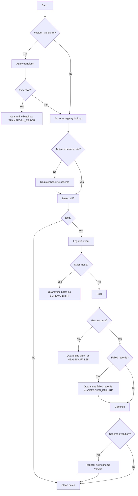
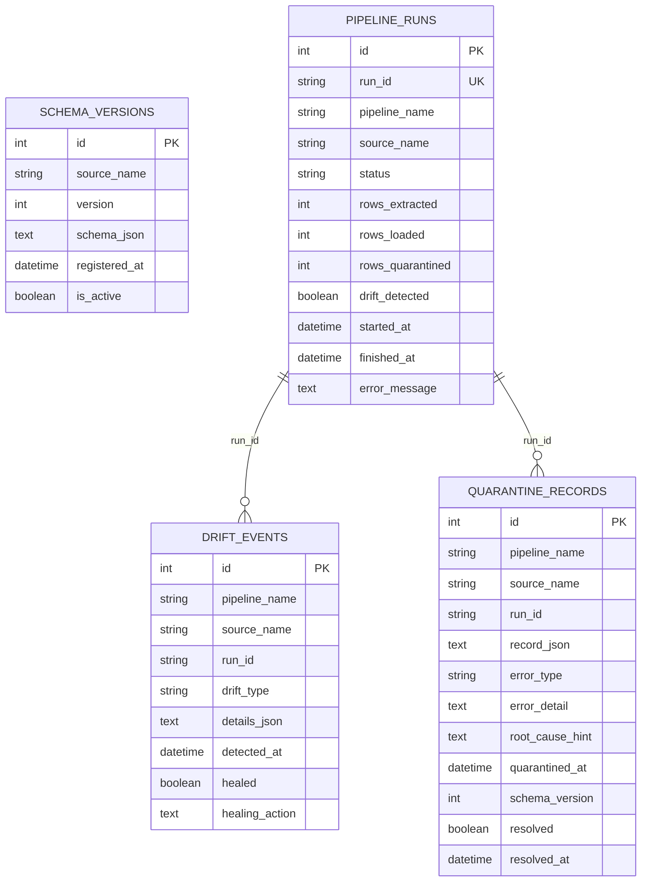

# Low-Level Design: Self-Healing ETL

## Code Layout

| Path | Purpose |
|---|---|
| `main.py` | CLI entry point and Prefect local runtime configuration. |
| `demo.py` | Built-in three-run self-healing demo. |
| `config.py` | Pydantic configuration models for pipeline, registry, healing, quarantine, and alerts. |
| `models.py` | SQLAlchemy ORM models and SQLite additive schema migration helper. |
| `pipeline/extractor.py` | CSV, JSONL, and DataFrame extractors plus Prefect extraction task. |
| `pipeline/transformer.py` | Business transform hook, schema registration, drift detection, healing, quarantine, and alerts. |
| `pipeline/loader.py` | CSV, JSONL, DB, and memory load task. |
| `pipeline/orchestrator.py` | Top-level Prefect flow. |
| `schema/registry.py` | Schema version registration and lookup. |
| `schema/drift_detector.py` | Canonical dtype mapping and drift report generation. |
| `healing/strategies.py` | Healing engine and type coercion helpers. |
| `quarantine/store.py` | Quarantine CRUD, drift event logging, resolution tracking, stats, MTTR, and MTTD. |
| `alerts/alerter.py` | Console and Slack alerting with root-cause hints. |
| `taxi_etl/*` | Real-time taxi producer, transformer, warehouse, runtime config, and dashboard. |
| `scenarios/failure_scenarios.py` | Executable failure and auto-healing scenarios. |
| `scenarios/failure_injector.py` | Unified demo injector for K8s and modern ETL staging/connectivity failures. |
| `scenarios/k8s_failure_injector.py` | Real-cluster K8s failure injection for local demos. |
| `agents/*` | Observer, RCA, planner, healer, validator, approvals, and autonomous loop. |
| `agents/k8s_observer.py` | Kubernetes workload observer that emits K8s failure events through `EventBus`. |
| `agents/ai_sre_loop.py` | K8s AI-SRE orchestration glue with dedupe and injected `K8sHealingEngine`. |
| `observability/*` | Event bus, trace/span helpers, telemetry readers, and dashboard metrics. |
| `knowledge/*` | Incident memory, deterministic runbooks, and healing action history. |
| `llm/ollama_client.py` | Optional Ollama JSON-generation client with deterministic fallback. |
| `healing/autonomous_healing.py` | Bounded autonomous healing executor and audit integration. |
| `healing/k8s_healing.py` | Bounded Kubernetes healing executor and audit/approval integration. |
| `deployment/*` | Dockerfiles and Kubernetes manifests for local Docker K8s demo. |
| `deploy_local_demo.ps1` | Builds images, applies manifests, restarts deployments, and waits for readiness. |
| `demo_k8s.py` | Interactive K8s failure injection and recovery demo. |

## Configuration Objects

### `ETLConfig`

| Field | Default | Notes |
|---|---|---|
| `pipeline_name` | `etl_pipeline` | Stored in pipeline runs, drift events, and quarantine records. |
| `batch_size` | `1000` | Used by extractor batching. |
| `max_retries` | `3` | Configuration-level value; task decorators currently set task-specific retries. |
| `schema_registry` | `SchemaRegistryConfig` | Registry DB URL and strict mode. |
| `quarantine` | `QuarantineConfig` | Quarantine DB URL and retention settings. |
| `healing` | `HealingConfig` | Enables coercion, backfill, schema evolution, and coercion loss gate. |
| `alerts` | `AlertConfig` | Slack webhook and minimum severity. |
| `autonomous` | `AutonomousConfig` | Autonomous healing, human approval, Ollama, and attempt-limit settings. |

### Taxi Runtime Configuration

`taxi_etl/config.py` defines:

- Warehouse table names: raw, fact, summary, date dimension, payment dimension.
- Canonical taxi columns and aliases for TLC-style input.
- Numeric and required-positive columns.
- Synthetic producer ranges and seed.
- Drift injection behavior for currency-formatted values and added columns.
- Runtime folders for raw, incoming, processed, failed, logs, warehouse, registry, and quarantine DBs.

## Orchestrator Flow

`etl_flow` in `pipeline/orchestrator.py` accepts:

| Parameter | Description |
|---|---|
| `source_name` | Logical source key used in schema registry. |
| `source_type` | `csv`, `jsonl`, or `dataframe`. |
| `destination_type` | `csv`, `jsonl`, `db`, or `memory`. |
| `config` | Optional `ETLConfig`; default is local SQLite config. |
| `source_path` | File path for CSV or JSONL sources. |
| `source_df` | In-memory source for tests, demo, taxi, and scenarios. |
| `destination_path` | File path or SQLAlchemy database URL. |
| `destination_table` | Table name for DB loads. |
| `custom_transform` | Optional `Callable[[DataFrame], DataFrame]`. |

### Flow Steps

1. Create a `run_id`.
2. Insert `PipelineRun(status="RUNNING")`.
3. Execute `extract_task`.
4. Execute `transform_task`.
5. Execute `load_task`.
6. Set final summary status.
7. Update `PipelineRun` with counts, drift flag, status, finish time, and error.
8. When autonomous mode is enabled, trigger RCA/planning/healing/validation for drift, quarantine, and hard failures.

## Extraction Design

| Source Type | Implementation |
|---|---|
| `csv` | `pd.read_csv(..., chunksize=batch_size, dtype_backend="numpy_nullable")`. |
| `jsonl` | Line-by-line JSON parsing into batch DataFrames. |
| `dataframe` | DataFrame slicing into batch-sized copies. |

`extract_task` returns a list of DataFrames. This is simple for Prefect task serialization and demos. For very large data volumes, this boundary should become streaming or generator-based outside Prefect task result storage.

## Transformation Design

`transform_task` performs all data validation and healing decisions.

## Drift Detection

`schema/drift_detector.py` canonicalizes pandas dtypes into buckets:

| Pandas dtype family | Canonical bucket |
|---|---|
| signed/unsigned integers | `integer` |
| floats | `float` |
| bool | `boolean` |
| object/string/category | `string` |
| datetime64 | `datetime` |
| timedelta64 | `timedelta` |

`DriftReport` captures:

- `added_columns`
- `removed_columns`
- `type_changes`
- expected and observed schemas
- root-cause hints
- JSON details for drift event persistence

## Healing Engine

Healing order:

1. Backfill missing columns with typed nulls.
2. Retain added columns when schema evolution is enabled, otherwise drop them.
3. Coerce changed columns toward the expected type.
4. Calculate coercion loss percentage.
5. Reject the batch if loss exceeds `max_coercion_loss_pct`.

| Target Type | Coercion Strategy |
|---|---|
| `integer` | `pd.to_numeric(...).astype("Int64")` |
| `float` | `pd.to_numeric(...)` |
| `boolean` | Parse common truthy/falsy values and cast to pandas boolean. |
| `datetime` | `pd.to_datetime(..., utc=True)` |
| `string` | Cast to string while preserving nulls. |

## Loading Design

| Destination | Behavior |
|---|---|
| `csv` | Append to file; write header only when destination does not exist. |
| `jsonl` | Append JSON records line by line. |
| `db` | Append to SQLAlchemy table; add missing columns before append. |
| `memory` | Return count only; used for tests and scenarios. |

For DB destinations, `_ensure_table_columns` inspects the target table and runs `ALTER TABLE ADD COLUMN <column> TEXT` for newly healed/evolved columns.

## Database Model

## Metrics Logic

`QuarantineStore.stats()` returns:

| Field | Meaning |
|---|---|
| `total` | Total quarantine records. |
| `unresolved` | Records not marked resolved. |
| `resolved` | Records marked resolved. |
| `by_error_type` | Quarantine counts by error type. |
| `by_source` | Quarantine counts by source. |
| `mttr_seconds` | Average manual quarantine resolution time. |
| `mttr_sample_count` | Number of resolved quarantine records used in MTTR. |
| `mttd_seconds` | Average pipeline detection latency for drift events. |
| `mttd_sample_count` | Number of drift events used in MTTD. |

## Taxi ETL Low-Level Flow

1. `run_producer` writes CSV or JSONL micro-batches into `data/taxi/incoming`.
2. Drift injection optionally converts `fare_amount` to currency text and adds `congestion_surcharge`.
3. `run_realtime_etl` polls incoming files.
4. `_process_file` reads each file into a DataFrame.
5. Raw records are inserted into `raw_taxi_trip`.
6. `etl_flow` processes the batch with `transform_taxi_trips`.
7. Clean records load to `fact_taxi_trip`.
8. Analytics tables are refreshed.
9. Input file moves to `processed`; exceptions move to `failed`.
10. Summary displays warehouse and evaluation metrics.

## Scenario Runner

Default scenarios include:

- Added column schema evolution.
- Missing column backfill.
- Numeric string type coercion.
- Partial coercion failure with row quarantine.
- Coercion loss gate with batch quarantine.
- Strict mode quarantine.
- Custom transform failure quarantine.
- Resource guard quarantine.
- Join missing dimension auto-heal.
- Join duplicate dimension auto-heal.
- Join unresolved key quarantine.
- Loader schema evolution.

Hard source/load failures are opt-in through `--include-hard-failures`.

## Extension Points

| Extension | How To Add |
|---|---|
| New source type | Add source function and branch in `extract_task`. |
| New destination type | Add loader function and branch in `load_task`. |
| New healing strategy | Add logic to `HealingEngine.heal` and update scenario coverage. |
| New domain pipeline | Provide a producer/source and `custom_transform`. |
| New metrics | Add persisted timestamps/counters and extend `QuarantineStore.stats`. |
| LLM/Ollama root-cause hints | Add an optional hint provider before alert dispatch or quarantine insert. |

## Agentic Autonomous Loop

`AutonomousHealingLoop` coordinates:

1. `RCAAgent` analyzes the triggering event with incident memory, optional Ollama, and deterministic fallback rules.
2. `PlannerAgent` maps the RCA into executable plan steps.
3. `HealerAgent` executes bounded actions through `AutonomousHealingEngine`.
4. `ValidatorAgent` checks loaded rows, quarantine tolerance, destination reachability, and successful actions.
5. Results are persisted through `pipeline_events`, `healing_actions`, and `incident_history`.

Human-in-the-loop mode sets `require_human_approval=True`, which persists the generated plan in `human_approvals` and emits `HumanApprovalRequested`.

`AutonomousHealingLoop` accepts an optional injected `healing_engine`. The ETL path uses `AutonomousHealingEngine`; the Kubernetes AI-SRE path injects `K8sHealingEngine` without changing the existing ETL loop API.

## Kubernetes AI-SRE Loop

`AISRELoop` coordinates the Kubernetes extension:

1. `K8sObserver` polls pods, deployments, and jobs in a namespace.
2. Events are emitted through the existing `EventBus`.
3. `ObserverAgent` filters failure events.
4. `AISRELoop` deduplicates rapid repeats by event type, component, namespace, and object name.
5. `AutonomousHealingLoop` performs RCA, planning, healing, validation, and incident recording.
6. `K8sHealingEngine` executes workload-scoped actions and records audit rows with `agent='K8sHealingEngine'`.

K8s observer detection:

| Signal | Event |
|---|---|
| Pod waiting reason `CrashLoopBackOff` | `K8sPodCrashLoopDetected` |
| Pod waiting reason `ImagePullBackOff` or `ErrImagePull` | `K8sImagePullFailed` |
| Last terminated reason `OOMKilled` | `K8sOOMKilled` |
| Restart count above threshold | `K8sHighRestartCount` |
| Deployment unavailable replicas or zero desired replicas | `K8sDeploymentDegraded` |
| Job failed pods | `K8sJobFailed` |

The observer probe is namespace-scoped (`list_namespaced_pod`) so the service account does not need broad namespace-list permissions.

## Local Docker Kubernetes Demo Flow

`deploy_local_demo.ps1` builds the ETL and AI-SRE images, applies manifests, restarts deployments to pick up rebuilt `latest` tags, and waits for readiness.

`demo_k8s.py --scenario image_pull`:

1. Confirms `kubectl` access.
2. Captures pod state.
3. Uses `K8sFailureInjector` to patch the ETL Deployment image to an invalid registry image.
4. Waits until the current Deployment generation is fully ready again.
5. Streams AI-SRE logs and prints approximate wall-clock MTTR.

The same entry point supports local ETL failure injection without Kubernetes:

| Scenario | Behavior |
|---|---|
| `api_rate_limit` | Emits an extractor HTTP 429 event and validates backoff plus retry actions. |
| `staging_data_quality` | Quarantines duplicate/null-key staging rows and records isolate/replay actions. |
| `timeout` | Emits a destination timeout and validates idempotent staging/load retry. |
| `concurrent_modification` | Emits a staging write conflict and validates rollback plus retry actions. |

## Known Technical Constraints

- Extractor currently materializes all batches in memory.
- SQLite is good for local demo, but production should use PostgreSQL or another managed database.
- Type inference depends on pandas dtype behavior.
- Loader adds new DB columns as `TEXT`; production systems should map stronger SQL types.
- True upstream MTTD requires a business event timestamp, which is not assumed.
- The local K8s demo uses `latest` image tags for convenience; production should use immutable image digests or version tags.
- The Kubernetes demo's MTTR is measured by `demo_k8s.py` from injection time to Deployment readiness, not from persisted incident timestamps.
